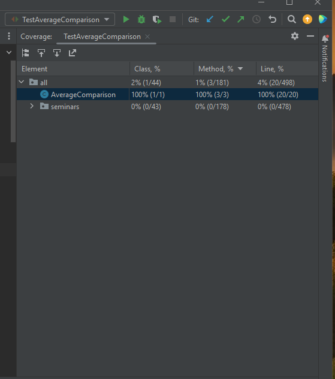

Задание:
Создайте программу на Python или Java, которая принимает два списка чисел и выполняет
следующие действия:
a. Рассчитывает среднее значение каждого списка.
b. Сравнивает эти средние значения и выводит соответствующее сообщение:
- "Первый список имеет большее среднее значение", если среднее значение первого списка больше.
- "Второй список имеет большее среднее значение", если среднее значение второго списка больше.
- "Средние значения равны", если средние значения списков равны.

Был создан класс AverageComparison, который содержит три метода findingAverage - находит среднее значение в списке,
comparisonTwoDoubles - сравнивает два числа, comparisonAverageTwoArrays - находит среднее значение в двух списках, 
сравнивает их между собой.

Для тестирования класса AverageComparison были написаны, следующие unit-тесты:
    - testFindingAverageCorrectData() - проверяет метод findingAverage при корректных данных;
    - testFindingAverageEmptyData() - проверяет метод findingAverage при пустом массиве;
    - testFindingAverageOneNumber() - проверяет метод findingAverage при одном числе в массиве;
    - testFindingAverageIsNull() - проверяет метод findingAverage при среднем, равном 0
    - testComparisonTwoDoubles() - проверяет метод comparisonTwoDoubles;
    - testComparisonAverageTwoArraysCorrectData() - проверяет метод comparisonAverageTwoArrays при корректно введенных данных;
    - testComparisonAverageTwoArraysEmptyArray() - проверяет метод comparisonAverageTwoArrays при пустом массиве.

